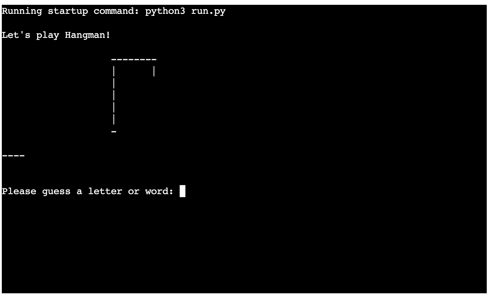
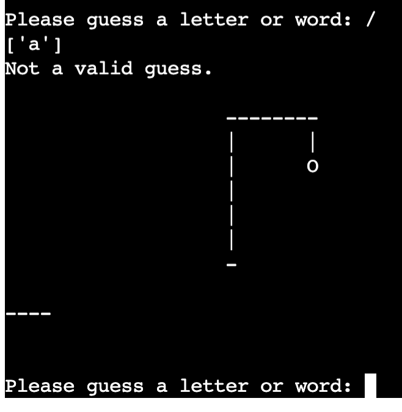
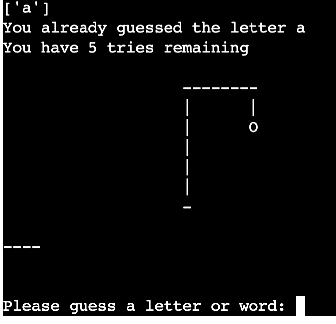

<h1>Hangman Game</h1>

Hangman is a Python terminal game, which runs in the Code Institute mock terminal on Heroku. 

Users can try and beat the computer by trying to work out what the word is, that the computer has randomly generated, within the 6 lives that they have been given.

<link>

Here is the live version of my project - https://nikki-lemon-hangman.herokuapp.com

<h2>How to Play</h2>

Hangman is based on the classic game of you have a random word you need to guess within a certain number of tries before the game is over. 

In this version, all the words will be animals. 

When the game begins, the player will see a blank hangman board and how many lives they have remaining, as well as a number of blank spaces which is how many letter are in the chosen word. 

The user will also be asked to guess a letter to see if it is in the chosen word.

If the guessed letter is in the chosen word, the computer will congratulate the player and will show were that letter fits in the word. 

If the letter is not in the word, the computer will ask the player to try again and take one of their lives away and visably show the hangman with his next body part. 

To win the game, the player must get all the correct letter before their lives are up. 

<h2>Features</h2>

Random word generation. 

- The words are randomly chosen from a Google Sheet. 
- This random word from the list is then transformed into blanks, waiting for the player to guess. 

- Player cannot see the random word chosen 
- Accepts uer input 
- Maintains letters that have been guessed 
- Input validation and error checking: you must enter letters/ you cannot enter the same guess twice 

<h2>Future Futures</h2>

 - Allow players to pick from a choice of catergories
 - Allow game to keep score of how many games the user has won before they decide to exit 
 - Have a difficulty setting that the user cn choose from

 <h2>Testing</h2>
 
I have manually tested this project by doing the following: 
 
 - Passed the code through s PEP8 linter and confirmed there are no problems
 - Given invalid inputs: when same input twice and incorrect entries
 - Tested in my local terminal and the Code Institute Heroku terminal

 <h2>Bugs</h2>
 
Solved Bugs
 
 - When I wrote the project I found a bug where the word wasn't pulling through correctly from the spreadsheet and was just returning as 1 letter and then being converted to a blank, ready for the user to guess. I fixed this with the help from Martina, we found that I needed to rename the global variable to soemthing else so it wasn't the same as a local variable in a function. 
 
 Remaining Bugs
 - I understand that my code isn't the easiest to read at the moment but I had a lot of bugs coming up when I was trying to make more functions in the code and I have left it as it is at the moment as the game works. In the future I would like to edit this code and make it cleaner and a lot easier to read. 
 
 Validator Testing
 
 - PEP8 - No errors were returned from PEP8online.com

 <h2>Deployment</h2>
 
This Project was deployed using Code Institute's mock terminal for Heroku:
 
 Steps for deployment:
 - Fork or clone this repository
 - Create a new Heroku App
 - Set the buildbacks to Python and NodeJS in that order
 - Link the Heroku app to the repository
 - Click on Deploy

 <h2>Credits</h2>
 
Code Institute for the deployment ternimal 
 Martina_mentor for helping me and guiding me through this project and being supportive all the way. 

